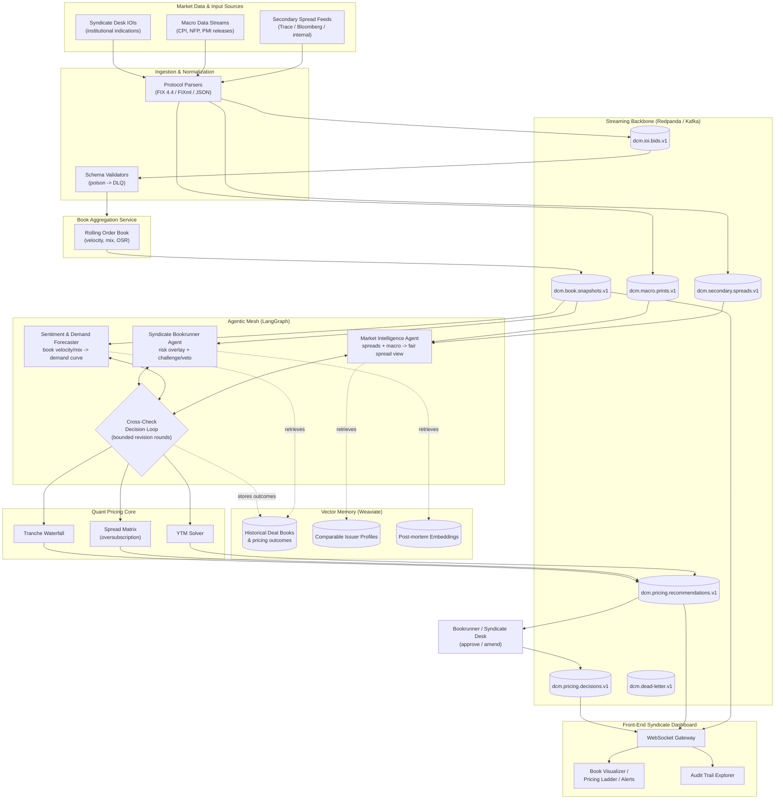

# DCM Syndicate Pricing & Bookbuilding Engine

An autonomous **Sovereign & Corporate Debt Capital Markets (DCM)** syndicate
pricing and bookbuilding platform. It ingests secondary-market spreads, macro
data, and live institutional Indications of Interest (IOIs) over
Redpanda/Kafka, aggregates a rolling order book, and runs a LangGraph
multi-agent mesh that cross-checks spread views, demand forecasts, and risk
constraints before publishing a final pricing recommendation.

---

## 1. System Architecture



**Data flow summary**

1. **Sources -> Kafka**: spread feeds, macro releases, and IOIs are parsed
   (FIX/JSON), validated, and produced to versioned topics with per-tranche
   partition keys (ordering preserved, consumer-group scalable).
2. **Kafka -> Book Aggregation**: the book-builder folds IOIs into a rolling
   per-tranche book (cumulative size, investor mix, velocity, best/worst
   limits) and re-publishes snapshots.
3. **Kafka -> LangGraph mesh**: the Market Intelligence Agent consumes
   spreads/macro; the Demand Forecaster consumes book snapshots; the
   Bookrunner holds a risk veto. The loop runs at most `MAX_REVISION_ROUNDS`
   revision cycles before converging.
4. **Weaviate memory**: the mesh embeds and retrieves historical deal books,
   comparable-issuer profiles, and past post-mortems to ground its reasoning;
   final outcomes are written back for continuous learning.
5. **Out to the desk**: recommendations go to a human bookrunner approval
   topic (human-in-the-loop by design) and stream to the dashboard over
   WebSockets for the live book visualizer and audit trail.

**Free public URL (dashboard + API) & full setup commands: see [GITHUB_SETUP.md](GITHUB_SETUP.md)** —
GitHub Pages from `/docs` for the frontend (landing + standalone dashboard) and a one-click
Render Blueprint (`render.yaml`) for the FastAPI backend, both free tier:

## 2. Repository Layout

```
dcm_engine/
  core/            # domain models + quant pricing library (YTM, spread matrix, waterfall)
  pipeline/        # Redpanda/Kafka producer (IOI simulator) + consumer (book builder)
  agents/          # LangGraph multi-agent mesh + LLM provider abstraction
  bridge/          # FastAPI REST/WebSocket bridge serving the dashboard live
  ml/              # online-learned demand/spread forecasters (JSON artifacts, no pickle)
  ml/train.py      # CSV trainer: any tabular data -> deployed model artifacts
deploy/
  deployment.yaml  # hardened K8s manifests (book-builder + agent-mesh + NetworkPolicy)
tests/             # pytest suites for pricing, agents, and pipeline
.github/workflows/ci.yaml  # lint + typecheck + tests + Trivy container scan
```

## 3. Quickstart

**One-command local stack (landing + live dashboard + API, no broker needed):**

```powershell
pip install -e ".[streaming,agents,api,dev]"
python -m dcm_engine.bridge.app      # http://127.0.0.1:8123
```

- `/` → landing page · `/dashboard` → live terminal (WebSocket feed) · `/api/book` → REST · `/health`
- The bridge auto-loads ML artifacts trained via the CSV trainer below.

**Train on your own data (any CSV):**

```powershell
python -m dcm_engine.ml.train your_deals.csv --features velocity,osr,fast_share --target demand_mm --label tightened
```

(Full local no-server quickstart retained below.)

### Quickstart (local, no broker required)

```powershell
# from the repo root
python -m venv .venv
.\.venv\Scripts\Activate.ps1
pip install -e ".[dev,streaming,agents]"
pytest -q                     # unit tests (no Kafka needed)
python -m dcm_engine.agents.demo   # run one full agent pricing decision
```

## 4. Running the Live Loop (Redpanda via Docker)

```powershell
# 1. Start Redpanda in Docker (Docker Desktop required)
docker run -d --name redpanda -p 9092:9092 `
  docker.redpanda.com/redpandadata/redpanda:latest `
  redpanda start --smp 1 --memory 1G `
  --kafka-addr PLAINTEXT://0.0.0.0:9092 `
  --advertise-kafka-addr PLAINTEXT://localhost:9092

# 2. Terminal A: stream simulated institutional IOIs (500/s for 60s)
python -m dcm_engine.pipeline.producer

# 3. Terminal B: aggregate the book and publish snapshots
python -m dcm_engine.pipeline.consumer
```

## 5. Configuration

| Env var | Default | Purpose |
| --- | --- | --- |
| `DCM_LLM_PROVIDER` | `rule` | `rule` (deterministic) or `langchain` (LLM-backed) |
| `DCM_LLM_MODEL` | `gpt-4o-mini` | Chat model when provider is `langchain` |
| `OPENAI_API_KEY` | - | Required only for the `langchain` provider |
| `KAFKA_BOOTSTRAP` | `localhost:9092` | Broker address (module args in code) |

## 6. Design Guarantees

- **Determinism**: with the rule-based provider, identical inputs produce
  byte-identical recommendations (auditable; enforced by test).
- **Bounded autonomy**: the cross-check loop has hard revision caps, spread
  floors/ceilings, and a per-round tightening circuit breaker.
- **Human-in-the-loop**: the engine *recommends*; a licensed bookrunner
  approves before any level is communicated to the street.
- **No event loss**: idempotent producers, `acks=all`, manual offset commits
  after the fold, DLQ routing for poison events, graceful SIGTERM drain.
- **Least privilege**: distroless non-root containers, read-only rootfs,
  dropped capabilities, default-deny NetworkPolicy.
